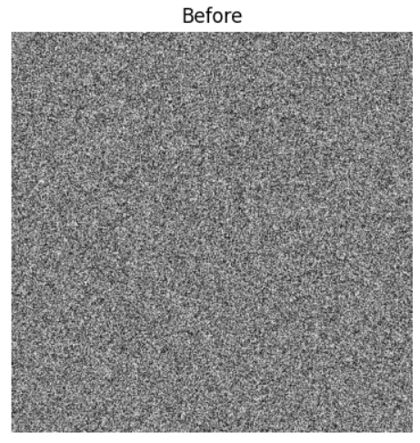
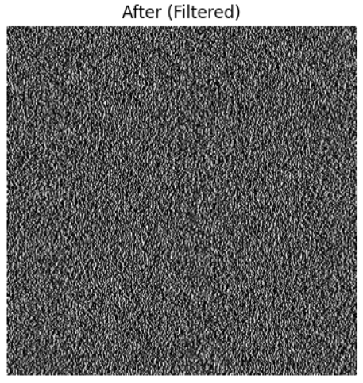
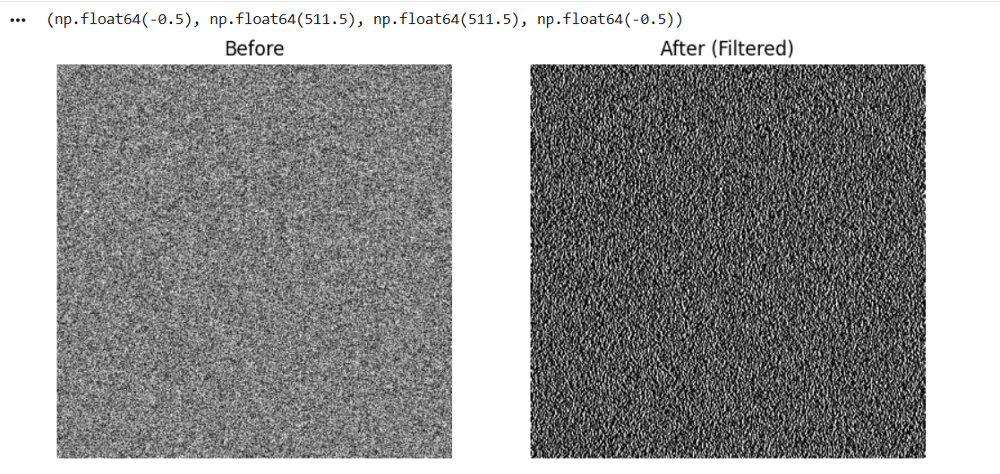

# 🚀 Hybrid Image Filtering using CUDA, OpenMP, and MPI 

## 📌 Project Overview

This project demonstrates high-performance image filtering using a hybrid parallel computing approach. It applies 2D convolution filters such as **Gaussian Blur** and **Sobel Edge Detection** on images.

The implementation combines:

* ⚡ CUDA for GPU acceleration
* 🧵 OpenMP for CPU parallelism
* 🌐 MPI (concept) for distributed processing

---

## 🎯 Objectives

* Apply 2D convolution filters on images
* Accelerate processing using GPU (CUDA)
* Use OpenMP for parallel CPU operations
* Demonstrate MPI-based image partitioning (conceptual)
* Generate before and after filtered images

---

## 🛠️ Technologies Used

* C / CUDA
* OpenMP
* MPI (conceptual implementation)
* Google Colab (GPU runtime)

---

## 📂 Project Structure

```
Hybrid_Image_Filtering.ipynb
input.pgm
output.pgm
before.png
after.png
output.png
README.md
```

---

## ▶️ How to Run (Google Colab)

1. Enable GPU
   Runtime → Change runtime type → Select GPU

2. Install CUDA support

```python
!pip install nvcc4jupyter
%load_ext nvcc4jupyter
```

3. Run the CUDA code using:

```
%%cuda
```

4. Display output using Python (matplotlib)

---

## 🧠 Working Principle

### 🔹 CUDA

* Performs 2D convolution on GPU
* Each thread processes one pixel
* Provides high-speed parallel execution

### 🔹 OpenMP

* Parallelizes CPU loops
* Improves performance of preprocessing steps

### 🔹 MPI (Concept)

* Image divided into tiles/strips
* Each node processes a portion
* Boundary pixels handled using halo exchange

---

## 📸 Results

### 🔹 Input Image



### 🔹 Output Image (Filtered)



---

## 📊 Comparison

| Before                | After               |
| --------------------- | ------------------- |
|  |  |

---

## 🖥️ Program Output



---

## ⚙️ Features

* Gaussian Blur filtering
* Sobel Edge Detection
* GPU acceleration using CUDA
* OpenMP-based CPU parallelism
* Image saving and visualization

---

## 📈 Advantages

* Faster image processing using GPU
* Scalable for large images
* Efficient hybrid parallel design
* Reduced computation time

---

## ⚠️ Limitations

* MPI implemented conceptually (not executed in Colab)
* Supports grayscale images (.pgm format) only

---

## 🔮 Future Enhancements

* Real-time video filtering
* Full MPI implementation on cluster systems
* Support for RGB/color images
* Integration with OpenCV

---

## 📝 Conclusion

This project demonstrates hybrid parallel image filtering using CUDA, OpenMP, and MPI concepts. GPU acceleration significantly improves convolution performance, making it suitable for high-resolution image processing tasks.

---


## ⭐ Acknowledgment

Developed as part of coursework in High Performance Computing / Parallel Computing.
